# Sanitization Management System

A web-based **Sanitization Management System** developed using Java and Spring Boot. The system provides an online platform for customers to browse sanitization services, submit service requests, make online payments, and track their service status.

The system also provides an **Admin Dashboard** through which administrators can manage sanitization services, customer requests, payments, and reports.

---

## About the Project

The Sanitization Management System is designed to simplify and digitize the process of booking and managing sanitization services.

The application provides separate functionality for **Customers** and **Administrators**.

### Customers can:

- Browse available sanitization services
- View service details and pricing
- Submit customer and service information
- Book sanitization services
- Make online payments
- Validate and confirm payments
- View payment success confirmation
- View service booking confirmation
- Track service request status

### Administrators can:

- Securely log in to the admin panel
- Manage sanitization services
- Add new services
- View customer service requests
- View customer information
- Manage service request status
- Monitor payment information
- Generate reports
- Monitor service bookings through the admin dashboard

---

## Features

### Customer Features

- User-friendly home page
- About Us page
- Browse sanitization services
- View service details and pricing
- Submit customer information
- Book sanitization services
- Online payment integration using Razorpay
- Payment validation and confirmation
- Payment success confirmation
- Service booking confirmation
- Service request tracking
- Responsive user interface
- Light/Dark theme support

### Admin Features

- Secure admin login
- Admin dashboard
- Add new sanitization services
- Manage existing services
- View service requests
- View customer information
- Update service request status
- View payment information
- Generate reports
- Monitor service bookings

### System Features

- JWT-based authentication
- Role-based access control
- MySQL database integration
- Cloudinary image storage
- Razorpay payment integration
- Form validation
- Exception handling
- Responsive design
- Environment-based configuration
- Secure handling of sensitive credentials

---

## Technologies Used

### Backend

- Java
- Spring Boot
- Spring MVC
- Spring Data JPA
- Hibernate
- Spring Security
- JWT Authentication
- REST APIs

### Frontend

- HTML5
- CSS3
- JavaScript
- Thymeleaf
- Tailwind CSS

### Database

- MySQL

### Third-Party Services

- **Razorpay** - Online payment processing
- **Cloudinary** - Image upload and cloud storage

### Development Tools

- IntelliJ IDEA
- Maven
- Git
- GitHub

---

## Application Workflow

The general customer workflow is:

```text
Home Page
    ↓
Browse Services
    ↓
Select Service
    ↓
Enter Customer Information
    ↓
Submit Service Request
    ↓
Payment Processing
    ↓
Payment Validation
    ↓
Payment Success
    ↓
Service Booking Confirmation
    ↓
Track Service Request
```

The general admin workflow is:

```text
Admin Login
    ↓
Admin Dashboard
    ↓
Manage Services
    ↓
View Service Requests
    ↓
View Customer Information
    ↓
Manage Request Status
    ↓
View Payments
    ↓
Generate Reports
```

---

## Screenshots

### Home Page

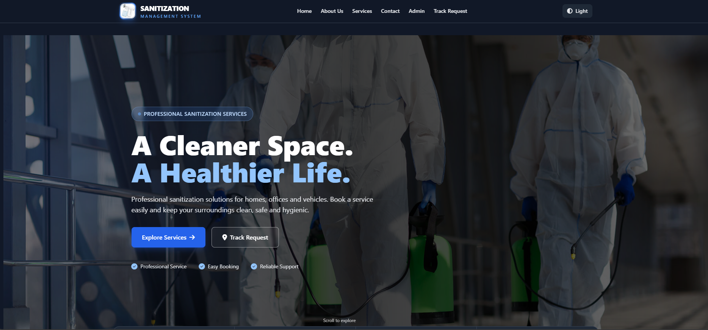

### About Us Page

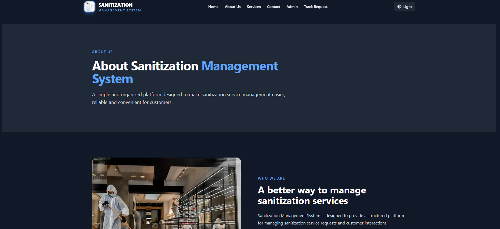

### Services Page

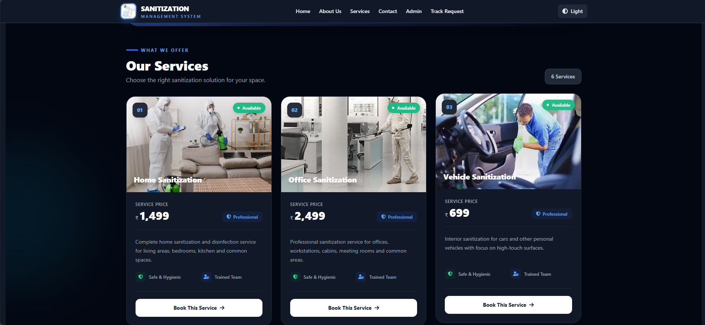

### Customer Information Page

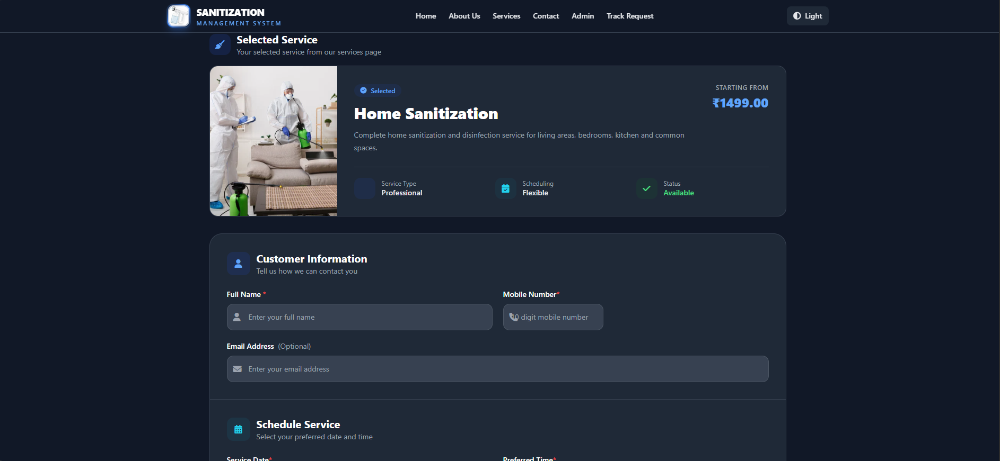

### Payment & Submit Button

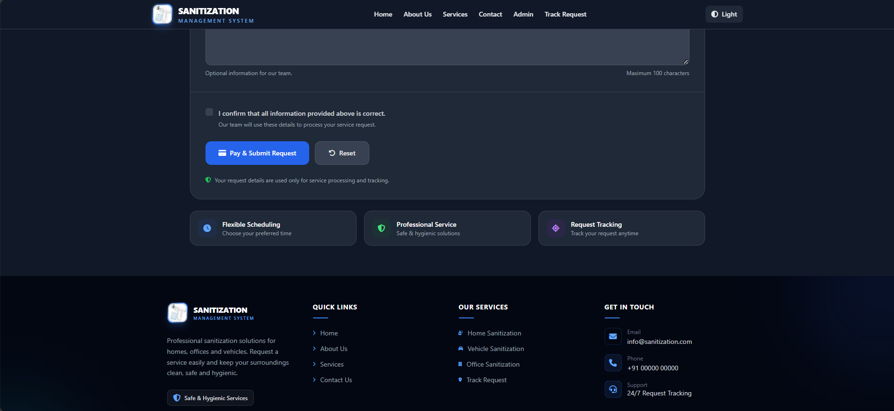

### Payment Type Page

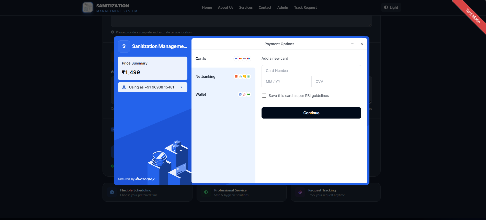

### Payment Processing Page

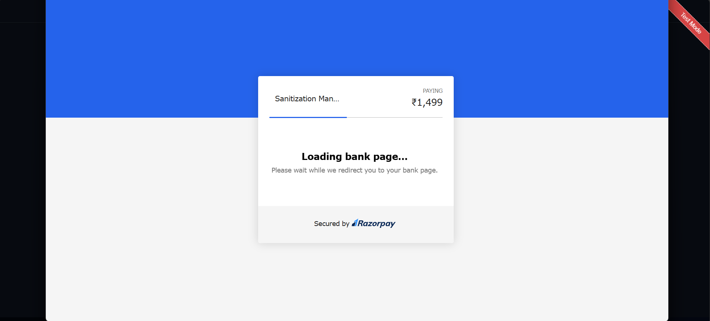

### Payment Validation Page

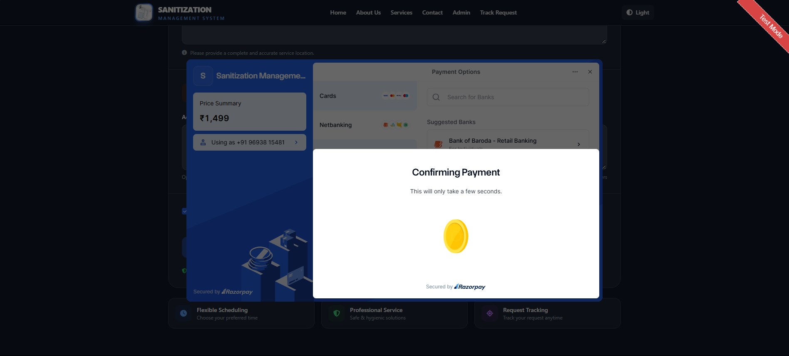

### Payment Success Page

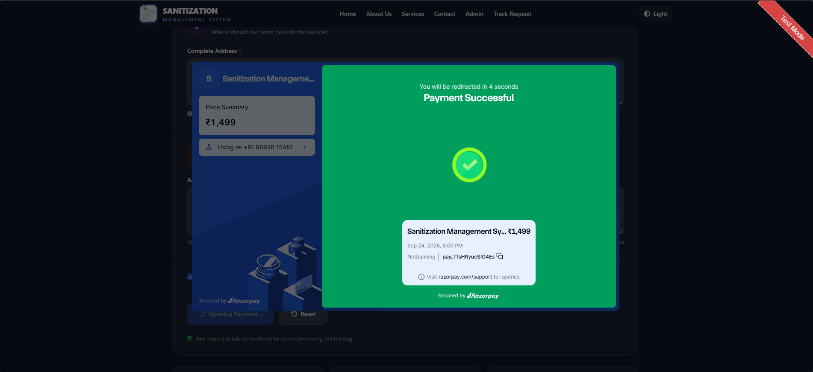

### Service Booked Page

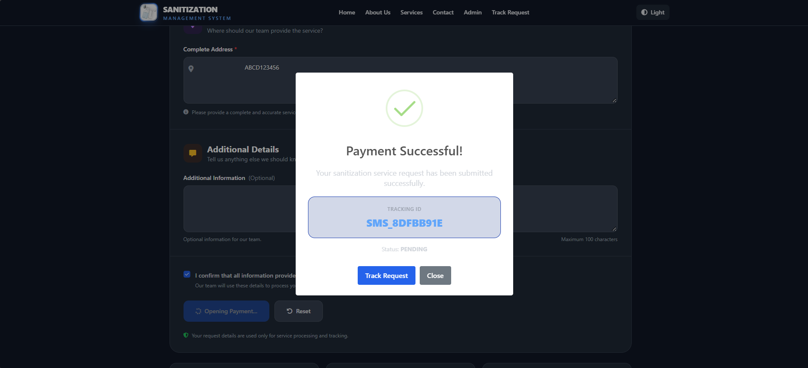

### Tracking Page

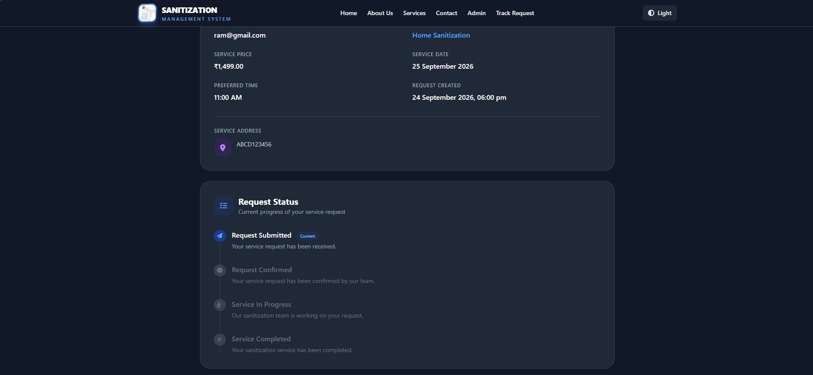

### Admin Login Page

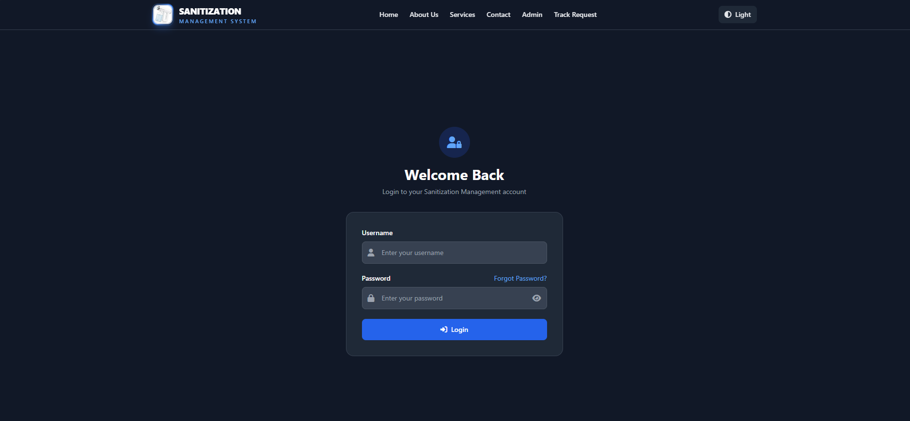

### Admin Dashboard Page

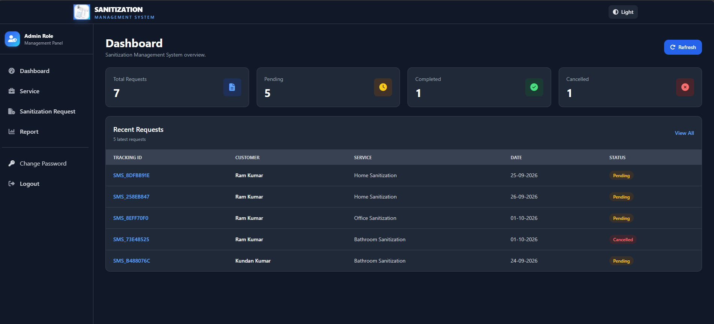

### Admin Add New Service Page

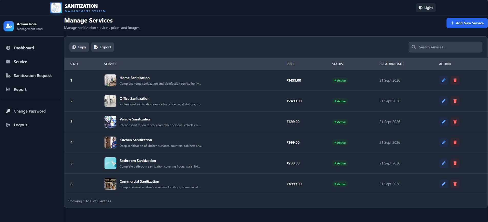

### Admin Service Request Page

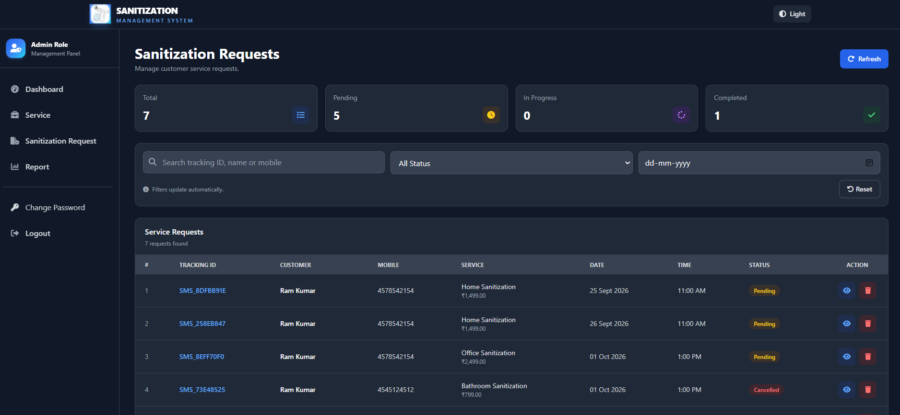

### Admin Report Page

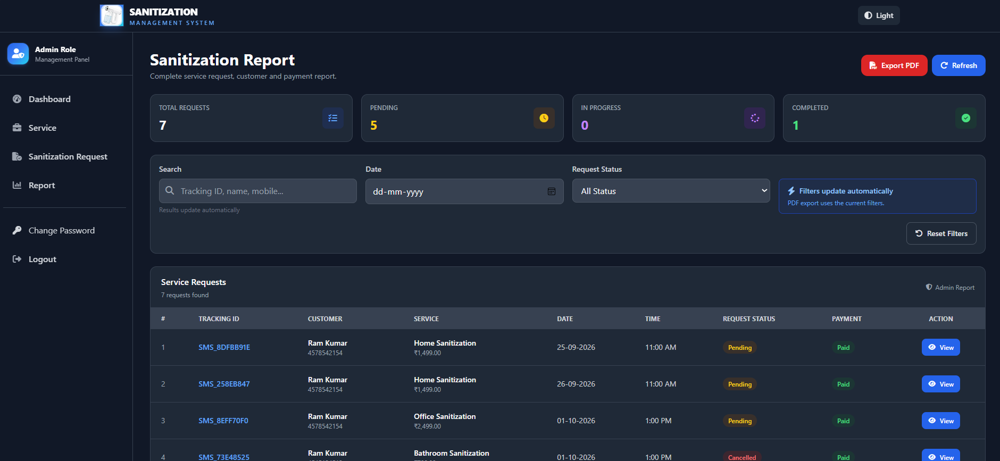

### Admin View Customer Data Page

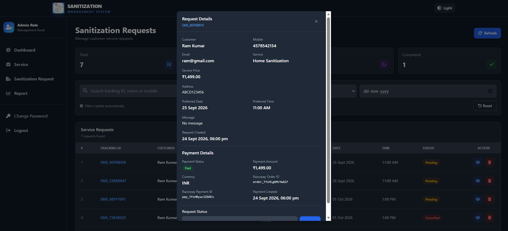

---

## Project Structure

```text
Sanitization-Management-System/
│
├── src/
│   ├── main/
│   │   ├── java/
│   │   │   └── com/sms/
│   │   │       ├── config/
│   │   │       ├── controller/
│   │   │       ├── dto/
│   │   │       ├── entity/
│   │   │       ├── exception/
│   │   │       ├── repository/
│   │   │       ├── security/
│   │   │       ├── service/
│   │   │       └── ...
│   │   │
│   │   └── resources/
│   │       ├── static/
│   │       ├── templates/
│   │       └── application.properties
│   │
│   └── screenshots/
│       ├── home.png
│       ├── about.png
│       ├── services.png
│       ├── cus-details.png
│       ├── pay-submit.png
│       ├── payment-type.png
│       ├── payment-process.png
│       ├── confirm-payment.png
│       ├── payment-success.png
│       ├── service-confirmed.png
│       ├── track-status.png
│       ├── login.png
│       ├── admin-dashboard.png
│       ├── add-service.png
│       ├── service-request.png
│       ├── report.png
│       └── view.png
│
├── pom.xml
├── .gitignore
├── mvnw
├── mvnw.cmd
└── README.md
```

---

## Configuration

The application uses environment variables for sensitive configuration such as:

- Database credentials
- Cloudinary credentials
- JWT secret
- Razorpay credentials
- Admin bootstrap credentials

Example configuration:

```properties
spring.datasource.url=${DB_URL}
spring.datasource.username=${DB_USERNAME}
spring.datasource.password=${DB_PASSWORD}

cloudinary.cloud-name=${CLOUDINARY_CLOUD_NAME}
cloudinary.api-key=${CLOUDINARY_API_KEY}
cloudinary.api-secret=${CLOUDINARY_API_SECRET}

jwt.secret=${JWT_SECRET}

razorpay.key-id=${RAZORPAY_KEY_ID}
razorpay.key-secret=${RAZORPAY_KEY_SECRET}

admin.bootstrap.enabled=${ADMIN_BOOTSTRAP_ENABLED:true}
admin.bootstrap.username=${ADMIN_BOOTSTRAP_USERNAME:admin}
admin.bootstrap.name=${ADMIN_BOOTSTRAP_NAME:Administrator}
admin.bootstrap.password=${ADMIN_BOOTSTRAP_PASSWORD}
```

> **Security Note:** Never commit actual passwords, API keys, API secrets, JWT secrets, or other sensitive credentials to GitHub.

---

## Prerequisites

Before running the application, make sure the following are installed:

- Java JDK
- Maven
- MySQL
- Git
- IntelliJ IDEA or another Java IDE

---

## How to Run

### 1. Clone the Repository

```bash
git clone https://github.com/YOUR_USERNAME/Sanitization-Management-System.git
```

### 2. Navigate to the Project

```bash
cd Sanitization-Management-System
```

### 3. Create the MySQL Database

Open MySQL and create the database:

```sql
CREATE DATABASE sms;
```

### 4. Configure Environment Variables

Configure the required environment variables in your local development environment.

Example:

```text
DB_URL=jdbc:mysql://localhost:3306/sms
DB_USERNAME=root
DB_PASSWORD=your_database_password

CLOUDINARY_CLOUD_NAME=your_cloud_name
CLOUDINARY_API_KEY=your_api_key
CLOUDINARY_API_SECRET=your_api_secret

JWT_SECRET=your_jwt_secret

RAZORPAY_KEY_ID=your_razorpay_key
RAZORPAY_KEY_SECRET=your_razorpay_secret

ADMIN_BOOTSTRAP_ENABLED=true
ADMIN_BOOTSTRAP_USERNAME=admin
ADMIN_BOOTSTRAP_NAME=Administrator
ADMIN_BOOTSTRAP_PASSWORD=your_admin_password
```

### 5. Build the Project

Using Maven:

```bash
mvn clean install
```

### 6. Run the Application

```bash
mvn spring-boot:run
```

Or run the main Spring Boot application class directly from IntelliJ IDEA.

### 7. Open the Application

Once the application starts successfully, open:

```text
http://localhost:9090
```

---

## Payment Integration

The application integrates **Razorpay** for online payment processing.

The payment workflow includes:

- Payment initiation
- Payment processing
- Payment validation
- Payment confirmation
- Successful payment handling
- Service booking confirmation

For security, Razorpay credentials are configured through environment variables and are not stored directly in the source code.

---

## Image Management

The application uses **Cloudinary** for image upload and cloud storage.

Service images can be uploaded and managed through the admin functionality.

Cloudinary credentials are configured using environment variables.

---

## Authentication & Security

The application uses authentication and authorization mechanisms to protect secured functionality.

Security-related features include:

- JWT-based authentication
- Role-based access control
- Protected admin functionality
- Secure credential configuration
- Environment variables for sensitive information
- Server-side validation
- Exception handling

---

## Database

The application uses **MySQL** as the relational database.

The application uses:

- Spring Data JPA
- Hibernate
- JPA entities
- Repository layer
- Service layer

for database interaction and application data management.

---

## Future Enhancements

Possible future improvements include:

- Email notifications for service bookings
- SMS notifications
- Advanced analytics dashboard
- Service scheduling and calendar management
- Improved payment transaction history
- Customer profile management
- Invoice generation
- Automated booking notifications
- Deployment to a cloud platform

---

## Project Highlights

- Full-stack Spring Boot web application
- Customer and Admin modules
- Online payment integration
- Service booking and tracking
- Admin dashboard
- MySQL database integration
- Cloudinary image management
- JWT-based authentication
- Responsive user interface
- Environment-based secret management

---

## Author

**Kundan Kumar**

**Sanitization Management System**

### Technologies

`Java` · `Spring Boot` · `Spring Security` · `Spring Data JPA` · `MySQL` · `Thymeleaf` · `JavaScript` · `Tailwind CSS` · `Razorpay` · `Cloudinary`

---

## License

This project is developed for educational and portfolio purposes.